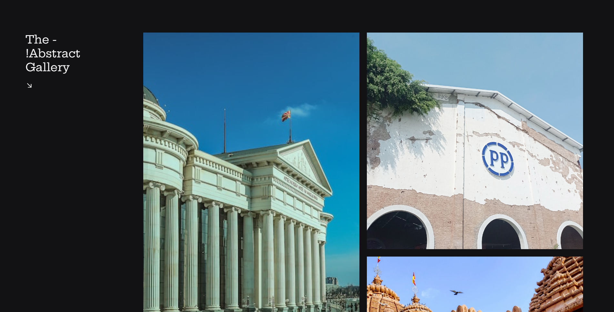

# Galeria de Fotos

Essa solução é uma galeria que pode ser utilizada e apresentada de diversas formas.

## Conteúdo

- [Visão geral](#visão-geral)
  - [Desafio](#desafio)
  - [Screenshot](#screenshot)
- [Meu processo](#meu-processo)
  - [Built with](#built-with)
- [Author](#author)

## Visão Geral

### Desafio

O desafio era:
-Criar uma galeria usando css grid

### Screenshot

## Meu processo

### Built with

- HTML5
- phosphoricons
- CSS Grid
- Mobile-first workflow

## Author

- Twitter - [@DiogovX](https://www.twitter.com/Diogovx_)
